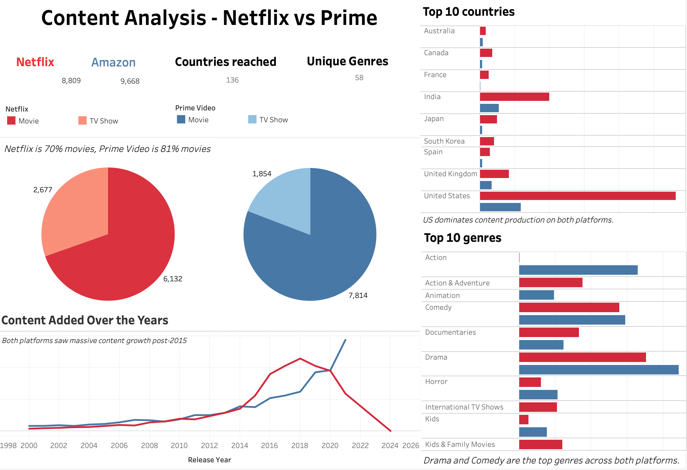

# OTT Platform Content Analysis — Netflix vs Amazon Prime

A Tableau dashboard comparing content performance and global reach across Netflix and Amazon Prime Video, built as part of a data analytics portfolio project.

---

## Dashboard Preview

---

## Dataset

The dataset contains **18,477 titles** combined across both platforms, with the following fields:

| Column | Description |
|--------|-------------|
| `show_id` | Unique identifier for each title |
| `type` | Movie or TV Show |
| `title` | Name of the content |
| `director` | Director name |
| `cast` | Main cast members |
| `country` | Country of production |
| `date_added` | Date added to the platform |
| `release_year` | Year of original release |
| `rating` | Content rating (e.g. PG, TV-MA) |
| `duration` | Runtime or number of seasons |
| `listed_in` | Genre categories |
| `description` | Short synopsis |
| `platform` | Netflix or Amazon Prime Video |

**Source:** Combined Netflix and Amazon Prime Video content catalog

---

## Dashboard Visualizations

The dashboard includes 5 interactive views:

**1. Platform Overview (KPI Tiles)**
Side-by-side comparison of total titles, countries reached, and unique genres across both platforms.

**2. Movie vs TV Show Breakdown**
Pie charts showing the content type split for each platform — Netflix (70% Movies, 30% TV Shows) vs Amazon Prime (81% Movies, 19% TV Shows).

**3. Top 10 Countries by Content**
Grouped bar chart showing which countries produce the most content on each platform.

**4. Top 10 Genres**
Side-by-side bar chart comparing genre popularity across Netflix and Amazon Prime.

**5. Content Added Over the Years**
Dual line chart showing how each platform grew its content library from 2000 to 2023.

---

## Key Insights

- **Amazon Prime has more titles** — 9,668 vs Netflix's 8,809, making it the larger library by volume
- **United States dominates** content production on both platforms by a significant margin
- **India is the second largest** content producer, especially strong on Amazon Prime
- **Drama and Comedy** are the top genres on both platforms
- **Both platforms saw explosive growth** post-2015, with Netflix peaking around 2019 and Amazon continuing to grow
- **Netflix has more TV Show diversity** (30%) compared to Amazon Prime (19%), suggesting Netflix invests more in original series
- **Amazon Prime leads in Action content**, while Netflix leads in International TV Shows and Documentaries

---

## Tools Used

- **Tableau Desktop** — dashboard design and visualization
- **Microsoft Excel** — data source
- **GitHub** — version control and portfolio hosting

---

## How to View

1. Download the dataset from this repository
2. Open Tableau Desktop
3. Connect to the Excel file
4. Recreate the dashboard following the visualization structure above

---

## Author

**Harshitha Babu**  
Computer Engineering Graduate — SUNY Binghamton  
Seeking Data Engineer & Data Analytics roles  

